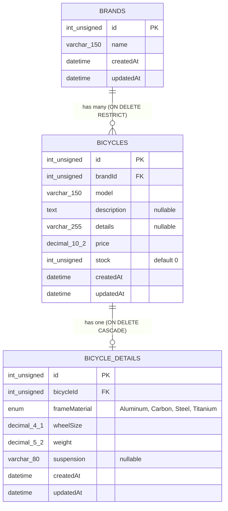
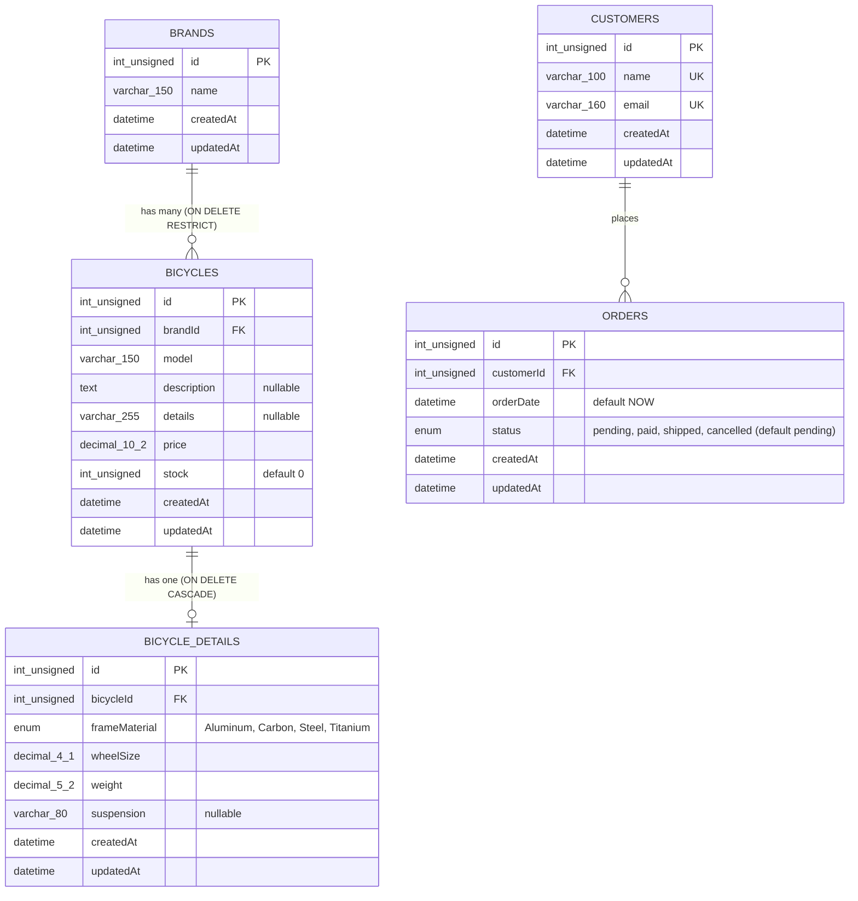
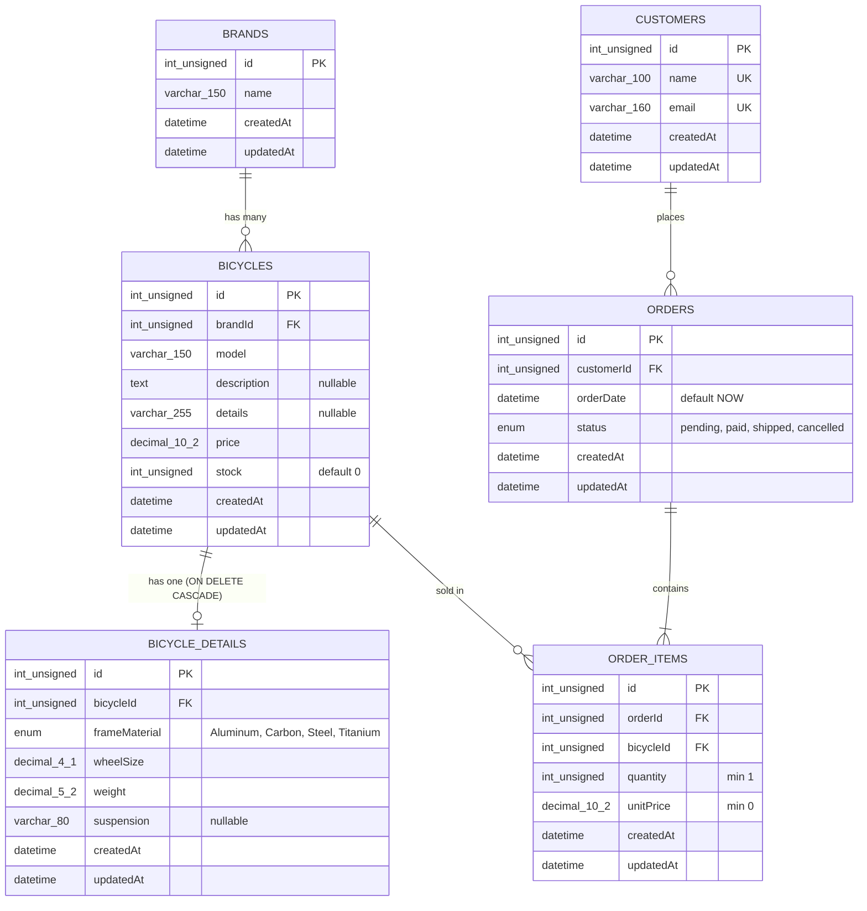

# Bicycle Shop

## Introduction

This is a learning project for building a backend API and connecting a frontend to it. Using a bicycle shop as an example, you will learn how to create API endpoints, store data in MySQL, and make HTTP requests from a React interface to create, read, update, and delete bicycles.

The backend uses TypeScript, Express, and Sequelize. The frontend uses TypeScript, React, and Vite.

To work through the project as a learning exercise, use the [learning branch](https://github.com/tcrurav/TypeScript-React-Express-Sequelize-Example/tree/learning).

**The `learning` branch is not available yet.** The link and cloning instructions below are prepared for when it is published; they will only work once that branch exists.

## Setup and development

### 1. Prerequisites

Install Git, Node.js with npm (a version compatible with Vite, such as Node.js 22.12+), and MySQL. Make sure the MySQL server is running before starting the backend.

### 2. Clone the learning branch

```bash
git clone --branch learning --single-branch https://github.com/tcrurav/TypeScript-React-Express-Sequelize-Example.git
cd TypeScript-React-Express-Sequelize-Example
```

Run the following setup steps from this project directory unless otherwise specified.

### 3. Create the database

Before running either application, create the database and configure both environment files.

Connect to MySQL using MySQL Workbench or the command-line client:

```bash
mysql -u root -p
```

Execute this SQL statement:

```sql
CREATE DATABASE IF NOT EXISTS db_bicycle_shop CHARACTER SET utf8mb4;
```

The backend's configured MySQL user must have permission to access this database and create its tables. In the completed implementation, Sequelize creates missing tables when the backend starts; the database itself must already exist.

### 4. Configure the backend environment

Create a file named `.env` inside `backend/`:

```dotenv
PORT=3000
DB_HOST=localhost
DB_PORT=3306
DB_NAME=db_bicycle_shop
DB_USER=your-database-username
DB_PASSWORD=your-database-password
```

Replace `DB_USER` and `DB_PASSWORD` with your local MySQL credentials. Adjust the host, port, and database name if your setup differs (the name must match the database created in step 3).

### 5. Configure the frontend environment

Create a file named `.env` inside `frontend/`:

```dotenv
VITE_API_URL=http://localhost:3000/api
```

This is the backend's base URL. Do not add a trailing slash or `/bicycles`, because the frontend appends endpoint paths itself. If you change the backend port, update this URL as well. Restart the relevant development server after changing an environment file.

### 6. Install dependencies

Install dependencies for both applications using their existing lockfiles:

```bash
cd backend
npm ci
cd ../frontend
npm ci
cd ..
```

### 7. Start both applications

Open two terminals in the project root and keep both running.

In the first terminal, start the backend:

```bash
cd backend
npm run dev
```

With the configuration above, the API runs at [http://localhost:3000/api](http://localhost:3000/api), and the bicycle endpoint is [http://localhost:3000/api/bicycles](http://localhost:3000/api/bicycles).

In the second terminal, start the frontend:

```bash
cd frontend
npm run dev
```

Open the local URL printed by Vite, usually [http://localhost:5173](http://localhost:5173). The frontend sends API requests to the URL configured in `frontend/.env`.

## Postman Links
Here you can use this postman example link to try out the ends points.
```bash
# For brands:
https://documenter.getpostman.com/view/54827853/2sBYB4L76P
# For bicycles:
https://documenter.getpostman.com/view/54827853/2sBYB4L7Ag
```

## Tech stack

| Layer | Technologies |
| --- | --- |
| Backend | Node.js, Express 5, TypeScript, Sequelize 6, MySQL (`mysql2`), `cors`, `dotenv`, `tsx` |
| Frontend | React 19, TypeScript, Vite, Tailwind CSS 4, oxlint |
| Database | MySQL (utf8mb4) |

## Project structure

```text
.
├── backend/
│   ├── .env / .env.example
│   └── src/
│       ├── server.ts              # Entry point: associations, DB connection, sync, listen
│       ├── app.ts                 # Express app: JSON, CORS, /api router, error handling
│       ├── config/                # env.ts (environment variables), database.ts (Sequelize)
│       ├── models/associations.ts # Relationships between all models
│       ├── routes/index.ts        # Mounts every module router under /api
│       ├── middlewares/           # not-found (404) and error (500) handlers
│       └── modules/               # One folder per entity: model, service, controller, routes
│           ├── brands/
│           ├── bicycles/
│           ├── bicycle-details/
│           ├── customer/
│           ├── order/
│           └── order-item/
└── frontend/
    ├── .env / .env.example
    └── src/
        ├── main.tsx, App.tsx
        ├── services/api.ts        # apiFetch: generic fetch wrapper using VITE_API_URL
        ├── components/ui/         # Reusable UI: Button, Modal
        ├── styles/global.css
        └── features/bicycles/     # Bicycle feature (types, services, hooks, components, pages)
```

The backend follows a **routes → controller → service → model** layering inside each module. The frontend is organised by **feature**, with `bicycleService` calling the API, the `useBicycles` hook managing state, and the page/components rendering the UI.

## Database model

The database has three tables, created by Sequelize from the models in `backend/src/modules/*/*.model.ts`. The relationships are declared in `backend/src/models/associations.ts`.



## Delivery 4: Customers and Orders

Delivery 4 extends the API with two new resources, **customers** and **orders**, on top of the brands, bicycles and bicycle details from delivery 3. The frontend does not change: it still only manages bicycles.

### Database model (delivery 4)

The database now has five tables. The new ones are `customers` and `orders`; the relationships are declared in `backend/src/models/associations.ts`.



The database has six tables now, created by Sequelize from the models in `backend/src/modules/*/*.model.ts`. All tables use an auto-incremental unsigned integer `id` as primary key and have `createdAt` / `updatedAt` timestamps.

## Delivery 5



Notes on the model:

- The physical table names are `brands`, `bicycles`, `bicycle-details`, `customers`, `orders` and `order_items`.
- `orders` and `bicycles` are related many-to-many through `order_items`, which also stores the quantity and the unit price at the moment of the sale.
- `bicycles.brandId` references `brands.id` with `ON UPDATE CASCADE` / `ON DELETE RESTRICT`, so a brand with bicycles cannot be deleted.
- Deleting a bicycle also deletes its `bicycle-details` row (`ON DELETE CASCADE`).
- Relationships are declared in `backend/src/models/associations.ts`.

## API reference

Base URL: `http://localhost:3000/api`. Requests and responses use JSON. Unknown routes return `404 {"message": "Ruta no encontrada"}` and unhandled errors return `500 {"message": "Error interno del servidor"}`.

| Resource | Base path | Endpoints |
| --- | --- | --- |
| Brands | `/brands` | `GET /`, `GET /:id`, `POST /`, `PUT /:id`, `DELETE /:id` |
| Bicycles | `/bicycles` | `GET /`, `GET /:id`, `GET /eagerly/:id` (with brand), `GET /eagerly/frame-material/:frameMaterial` (with detail, filtered), `POST /`, `PUT /:id`, `DELETE /:id` |
| Bicycle details | `/bicycle-details` | `GET /`, `GET /:id`, `GET /eagerly/:id`, `POST /`, `PUT /:id`, `DELETE /:id` |
| Customers | `/customers` | `GET /`, `GET /:id`, `GET /:name_search/orders` (customers matching the name, with their orders), `POST /`, `PUT /:id`, `DELETE /:id` |
| Orders | `/orders` | `GET /`, `GET /:id`, `GET /customers/:id` (orders of a customer), `POST /`, `PUT /:id`, `DELETE /:id` |
| Order items | `/order-items` | Controller, service and routes exist, but the router is **not mounted yet** in `routes/index.ts` |

Example: create a bicycle.

```bash
curl -X POST http://localhost:3000/api/bicycles \
  -H "Content-Type: application/json" \
  -d '{"brandId": 1, "model": "Tarmac SL7", "description": "Road bike", "price": 3499.99, "stock": 5}'
```

## Available scripts

| Where | Command | Description |
| --- | --- | --- |
| `backend/` | `npm run dev` | Starts the API with `tsx watch` (auto-reload) |
| `backend/` | `npm run build` | Compiles TypeScript to `dist/` |
| `backend/` | `npm start` | Runs the compiled server (`dist/server.js`) |
| `frontend/` | `npm run dev` | Starts the Vite dev server |
| `frontend/` | `npm run build` | Type-checks and builds for production |
| `frontend/` | `npm run lint` | Runs oxlint |
| `frontend/` | `npm run preview` | Serves the production build locally |

## Known issues and notes

- **`sequelize.sync({ force: true })` is used in `server.ts`.** Every time the backend starts, all tables are dropped and recreated, so **all data is lost on each restart**. Change it to `sync()` (or `sync({ alter: true })`) to keep your data.
- The `order-items` router is not registered in `routes/index.ts`, so its endpoints are not reachable yet.
- The `findEagerlyById` methods in the order, order-item and customer services include a model on itself (with aliases that are not defined in the associations), so the eager endpoints for those resources need to be fixed before they can be used.
- The frontend `Bicycle` type (`brand: string`) does not match the backend model yet (`brandId`, `details`); the frontend will need adapting once it consumes brands.
- Never commit real credentials: use `.env.example` as a template and keep `.env` out of version control.


## Recommended links

- [Express documentation](https://expressjs.com/) — routing, middleware, and backend APIs.
- [Sequelize v6 documentation](https://sequelize.org/docs/v6/) — models and database queries.
- [MySQL: Creating and selecting a database](https://dev.mysql.com/doc/refman/8.4/en/creating-database.html) — database setup.
- [React: Quick Start](https://react.dev/learn) — components, state, and events.
- [Vite: Getting Started](https://vite.dev/guide/) — frontend development tooling and Node.js requirements.
- [npm ci documentation](https://docs.npmjs.com/cli/v11/commands/npm-ci/) — installing dependencies from a lockfile.
